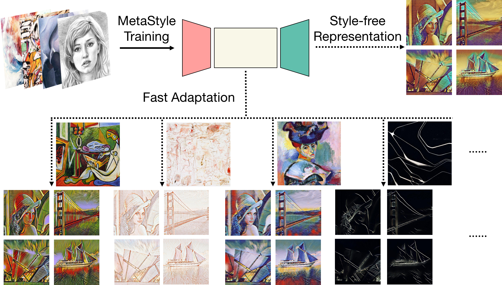
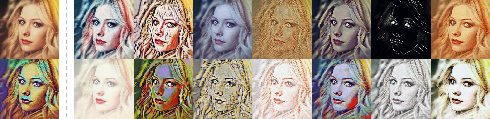

# MetaStyle

This repo contains the PyTorch code for our AAAI 2019 paper.  

[MetaStyle: Three-Way Trade-Off Among Speed, Flexibility, and Quality in Neural Style Transfer](http://wellyzhang.github.io/attach/aaai19zhang.pdf)  
Chi Zhang, Yixin Zhu, Song-Chun Zhu  
To appear in *Proceedings of the AAAI Conference on Artificial Intelligence (AAAI)*, 2019.  

In this paper, we propose to combine neural style transfer with bilevel optimization to trade off speed, flexibility, and quality. In contrast to previous methods, our approach could handle arbitrary artistic style (flexibility) in a real-time manner (speed) and achieves good image quality comparable to the impressive but slow iterative-optimization-based method proposed in Gatys *et al*. (quality). We instantiate the model using an image transformation network and solve it by Adam. The bilevel optimization encourages the model to first find the style-free representation of images (hence the name) and after super-fast model adaptation, we could have a model tailored to a style specifically. For further details, please refer to our [paper](http://wellyzhang.github.io/attach/aaai19zhang.pdf). 



# Examples

We show some samples below. The left column shows the content image and its style-free representation. The rest of the figure displays different stylized content images.



The following figure shows comparison with other methods.


# Dependencies

**Important**
* PyTorch (>= 0.4.0)
* CUDA and cuDNN

See ```requirements.txt``` for a full list of packages required.

# Usage

## Training

To train a model of your own:

1. First download a content image dataset and a style image dataset. In this paper, we use [MS-COCO](http://cocodataset.org/#download) and [WikiArt](https://www.kaggle.com/c/painter-by-numbers). 
2. Run
```
python src/main.py train --content-dataset <path-to-your-content-dataset> --style-dataset <path-to-your-style-dataset> --cuda 1
```

Usually, the default parameters should work. However, you are always welcome to fine tune yourself. The training process could be monitored using Tensorboard. Since bilevel optimization requires "second-order" gradient computation, the training process might take a long time depending on the GPU you have, and the GPU memory consumption is huge. 

We provide our pre-trained model [here](https://drive.google.com/file/d/1QuO8PAi5AFHt4gFU2f2uyoI7oyUbFtmV/view?usp=sharing).

## Fast Training

To adapt the model to a new style, run
```
python src/main.py train --content-dataset <path-to-your-content-dataset> --style-image <path-to-your-style-image> --model <path-to-your-trained-model> --cuda 1
```

Usually fast adaptation requires only 100 to 200 post update steps and could be done in less than 30 seconds, depending on the GPU you have.

## Testing

To stylize a content image, run
```
python src/main.py test --content-image <path-to-your-content-image> --output-image <path-to-your-output-image> --model <path-to-your-trained-model> --cuda 1
```

# Citation

If you find the paper and the code helpful, please cite us.
```
@inproceedings{zhang2019metastyle,
    author = {Zhang, Chi, Zhu, Yixin, Zhu, Song-Chun},
    title = {MetaStyle: Three-Way Trade-Off Among Speed, Flexibility, and Quality in Neural Style Transfer},
    booktitle = {Proceedings of the AAAI Conference on Artificial Intelligence (AAAI)},
    year = {2019}}
```

# Acknowledgement

This project is impossible to finish without the help of my colleagues and the following open-source implementations. 

* [Fast Neural Style](https://github.com/jcjohnson/fast-neural-style)
* [PyTorch Examples](https://github.com/pytorch/examples/tree/master/fast_neural_style)
* [Original MAML](https://github.com/cbfinn/maml)
* [PyTorch MAML](https://github.com/katerakelly/pytorch-maml)
* [OpenAI Reptile](https://blog.openai.com/reptile/)
* [AdaIN](https://github.com/xunhuang1995/AdaIN-style)
* [PyTorch AdaIN](https://github.com/naoto0804/pytorch-AdaIN)

# License

MetaStyle is freely available for non-commercial use, and may be redistributed under these conditions. Please see the [license](./LICENSE) for further details. For commercial license, please contact the authors.
